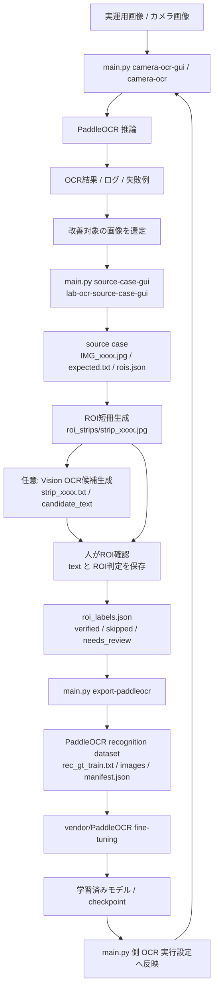
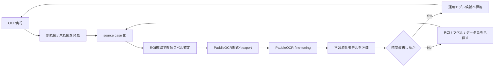

# OCR Accuracy Data Flow

| 項目 | 内容 |
| --- | --- |
| 文書ID | `LABOCR-ACCURACY-DATA-FLOW` |
| 作成日 | `2026-05-05` |
| 作成者 | `Codex` |
| 最終更新日 | `2026-05-05` |
| 最終更新者 | `Codex` |
| 版数 | `v1.0` |
| 状態 | `運用中` |

## 1. 概要

本書は、`main.py` を入口にした PaddleOCR 実行系と、`lab-ocr-source-case-gui` を入口にした教師データ整備系を総合して、OCR 認識精度向上のためのデータの流れを定義する。

詳細な source case 作成手順は [ocr_source_case_workflow.md](ocr_source_case_workflow.md) を参照する。OCR実行時のROI、前処理、後処理、ログ整形などの外側アルゴリズム設計は [ocr_support_algorithm_design.md](ocr_support_algorithm_design.md) を参照する。

本書はこれらの上位設計として、画像データ、教師データ、export 済み dataset、学習結果、実行時 OCR の関係を扱う。

## 2. 責務境界

| 領域 | 主な入口 | 主なデータ | 責務 |
| --- | --- | --- | --- |
| OCR 実行 | `python main.py camera-ocr-gui` / `python main.py camera-ocr` | カメラ画像、切り出し画像、OCR結果ログ | 現在の PaddleOCR で推論し、運用上の失敗例や改善対象を見つける |
| 教師データ準備 | `python main.py source-case-gui` / `lab-ocr-source-case-gui` | source case、ROI 短冊、`roi_labels.json` | 人が確認した ROI 単位の正解ラベルを作る |
| PaddleOCR export | `python main.py export-paddleocr` / `lab-ocr-export-paddleocr-dataset` | `rec_gt_train.txt`、`images/`、`manifest.json` | `verified` な ROI だけを PaddleOCR recognition dataset に変換する |
| PaddleOCR 学習 | `vendor/PaddleOCR` | export 済み dataset、学習設定、checkpoint | PaddleOCR 本体側で fine-tuning する |
| 学習結果の導入 | `main.py` / wrapper | 学習済みモデル、設定、評価結果 | 実行系で使うモデル候補として扱う |

`lab-ocr-source-case-gui` は学習実行を行わない。`main.py` は source case GUI と export への入口を提供するが、PaddleOCR 本体の学習処理は `vendor/PaddleOCR` 側の責務とする。

## 3. 全体データフロー



## 4. データごとの意味

| データ | 作成元 | 次に渡す先 | 意味 |
| --- | --- | --- | --- |
| 実運用画像 / カメラ画像 | OCR 実行現場 | `main.py camera-ocr*`、source case 作成 | 認識精度を上げたい実データ |
| OCR結果 / ログ | PaddleOCR 実行 | 改善対象選定 | 誤認識、読めない領域、後処理不足を見つける材料 |
| source case | `lab-ocr-source-case-gui` | ROI確認、export | 学習データを作るための元資産 |
| `expected.txt` | 人が確認した全文 | source case 監査 | ページ全体の正解テキスト。ROI 学習ラベルとは別 |
| `roi_strips/` | ROI生成 | ROI確認、export | PaddleOCR recognition 学習の画像候補 |
| `candidate_text` | Vision OCR 候補 | 人の確認 | 入力補助。未確認のまま学習に使わない |
| `roi_labels.json` | ROI確認 | export | ROIごとの確定ラベルと判定状態 |
| `rec_gt_train.txt` | export | PaddleOCR 学習 | PaddleOCR recognition 用の画像パスと正解文字列 |
| `manifest.json` | export | 監査、再現確認 | export 対象、除外件数、元ROIとの対応 |
| 学習済みモデル | PaddleOCR 学習 | `main.py` 実行系 | 認識精度向上の成果物 |

## 5. 判定状態と学習投入

`roi_labels.json` の `status` は、PaddleOCR に渡してよいかを決める境界である。

| status | GUI 表示 | export 対象 | 意味 |
| --- | --- | --- | --- |
| `needs_labeling` | 未確認 | いいえ | まだ人が確認していない |
| `needs_review` | 保留 | いいえ | 判断保留。ROI分割や読順の再確認が必要 |
| `verified` | 学習に使う | はい | 画像と `text` を照合済み |
| `skipped` | 使わない | いいえ | 学習対象から外す |

PaddleOCR に直接渡すのは、export 後の `rec_gt_train.txt` と `images/` である。`candidate_text`、`strip_XXXX.txt`、`vision_ocr_summary.json` は学習入力ではない。

## 6. main.py の入口

`main.py` は、OCR実行と教師データ準備の疎結合な入口を提供する。

```bash
python main.py camera-ocr-gui
python main.py source-case-gui
python main.py export-paddleocr source_cases/img_0685 --output exports/img_0685
```

`source-case-gui` は GUI を起動するだけで、PaddleOCR 学習は実行しない。`export-paddleocr` は `verified` な ROI だけを PaddleOCR recognition dataset へ変換する。

## 7. 精度向上ループ



このループでは、モデルだけでなく、ROI分割、教師ラベル、除外判定、前処理、後処理も改善対象とする。PaddleOCR 本体を直接変更する前に、外側のデータと wrapper の品質を上げる。

## 8. 現時点の実装範囲

実装済み:

- `lab-ocr-source-case-gui` による source case 作成
- ROI短冊の OCR 候補生成
- ROI確認タブでの `text` / `status` 保存
- `python main.py export-paddleocr`
- `lab-ocr-export-paddleocr-dataset`
- `verified` ROI のみを `rec_gt_train.txt` と `images/` へ export
- export 時の `manifest.json` 作成

未実装または今後の対象:

- train / validation 分割
- PaddleOCR 学習コマンドの wrapper 化
- 学習済みモデルの配置ルール
- 学習前後の評価レポート
- `main.py camera-ocr-gui` で学習済みモデルを選択する導線

## 9. 運用上の注意

- `candidate_text` を未確認のまま学習に使わない。
- `verified` でも、画像に写っていない説明文が `text` に入っている場合は学習に使わない。
- export 先は再生成可能な派生物として扱う。
- PaddleOCR 本体は upstream/vendor として扱い、原則このリポジトリ側から直接変更しない。
